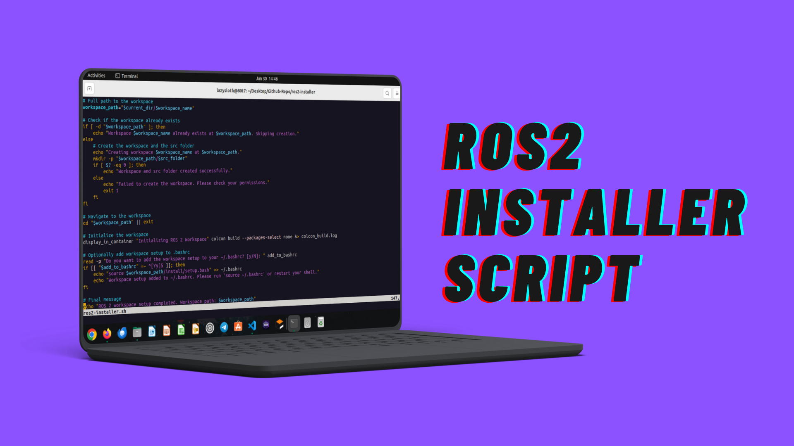

# ROS2 Installer

> **Disclaimer:**
> This is not an official ROS2 distribution.
> This project provides convenient automation to install ROS2 using the official repositories. The owner of this project, platform, or service shall not be held liable for any loss, damage, or corruption of data, whether caused by system failures, user errors, or any other unforeseen circumstances. By using this service, you acknowledge and agree that you are solely responsible for backing up and protecting your data. No warranties are provided regarding the security, accuracy, or completeness of any data stored or processed through the service.



---

## Who is it for?

* 🐣 **Beginners** who want a guided ROS2 setup without memorizing commands
* 💼 **Experienced developers** needing a quick, repeatable installation
* 🦥 **Anyone** who doesn’t feel like copy-pasting commands from the ROS2 docs every time

---

## Installation Options

| Sl.No | Option                                                         | Status         |
| ----- | -------------------------------------------------------------- | -------------- |
| 1     | [Python Package (pip)](#installation-via-pip-recommended)     | **Stable ✅**   |
| 2     | [Bash Script](#bash-script-install-alternative)               | Stable         |

---

## 🚀 Installation via pip (**Recommended**)

> **Tip:**
> Read the [source code](./python_package/ros2_installer/cli.py) or ask ChatGPT what the script does before running any installer.

**PyPI Project Page:**  [https://pypi.org/project/ros2-installer/](https://pypi.org/project/ros2-installer/)

**Install:**

```bash
pip install ros2-installer
```

**Run the installer (with sudo):**

```bash
sudo ros2-installer
```

You will be prompted to select:

* Your desired ROS2 distro (`humble`, `iron`, etc.)
* Workspace name and location
* Whether to auto-source the environment

---

## 🐚 Bash Script Install (Alternative)

If you prefer a one-liner:

```bash
curl -sSL https://raw.githubusercontent.com/mohammedrashithkp/ros2-installer/stable/ros2-installer.sh | bash
```

This script performs the same installation logic in bash.

---

## 🧪 Testing with Containers

You can test the installer in a clean environment using Podman or Docker:

```bash
# Clone the repo

git clone https://github.com/mohammedrashithkp/ros2-installer.git

# Go into project root

cd ros2-installer

# If you are using docker

docker build -f test/Dockerfile -t ros2-installer .
docker run -it --rm ros2-installer

# If you are using podman

podman build -f test/Dockerfile -t ros2-installer .
podman run -it --rm ros2-installer

```

---

## 🛠 What Happens Under the Hood?

1. **Ubuntu Codename Detection:**
   The installer reads `/etc/os-release` to detect your codename (`jammy`, `noble`, etc.).
2. **Prompt for ROS2 Distro:**
   You choose which ROS2 release to install.
3. **Dependencies:**
   Installs required system packages and ROS2 Desktop.
4. **Workspace Creation:**

   * Prompts you for a workspace name/location.
   * Initializes the workspace (`src`, `build`, `install` folders).
5. **Environment Sourcing:**
   Optionally appends `source /path/to/install/setup.bash` to your `~/.bashrc`.

After installation, you can:

* Clone ROS2 packages into your `src` folder.
* Build with `colcon build`.
* Start working immediately.

For creating new packages, follow the [official ROS2 tutorial](https://docs.ros.org/en/humble/Tutorials/Beginner-Client-Libraries/Creating-Your-First-ROS2-Package.html).

---

## ⭐ Star the Project

If this saves you time, please [star the repository](https://github.com/mohammedrashithkp/ros2-installer)!
Happy ROS2 hacking!

---

## 📜 License

See [LICENSE](./LICENSE) for details.

---


